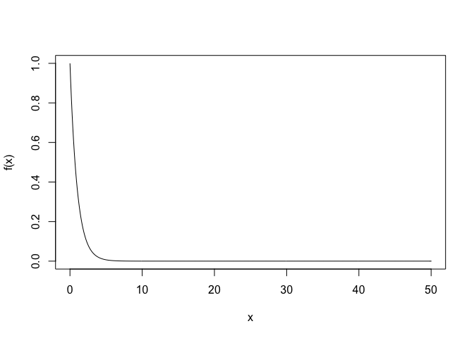
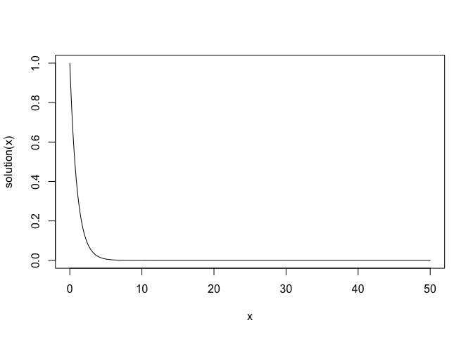
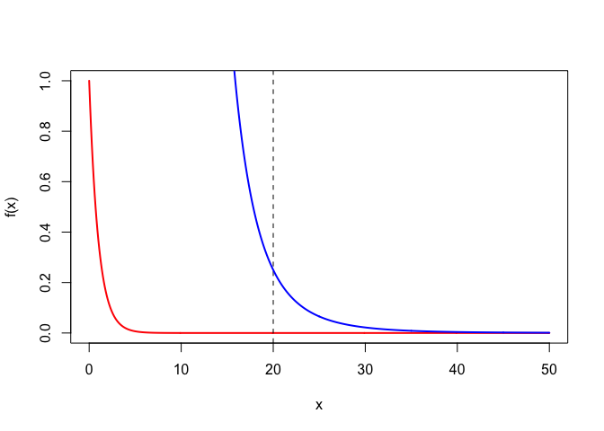

Importance Sampling
================
Rachel Han
26/11/2019

This example is adapted from
[here](http://www.di.fc.ul.pt/~jpn/r/ECS/index.html#use-of-importance-sampling-to-compute-an-integral).

The problem is to solve \(I(a) = \int_a^{\infty} e^{-x} dx\). The target
density is \(e^{-x}\) which looks like,

``` r
x <- seq(0,50,0.1)
f<- function(x) {exp(-x)}
plot(x,f(x),type='l')
```

<!-- -->

The exact solution is given by \(I(a) = e^-a\).

``` r
solution <- function(a){exp(-a)}
plot(x,solution(x),type='l')
```

<!-- -->

Next we choose the importance density $ q = $. We plot the target and
importance density.

``` r
a<-20
alpha <- 5
q <- function(x,xm,alpha) alpha*xm^alpha/x^(alpha+1)

plot(x,f(x), type="l", col= "red",lwd=2, xlab="x", ylab="f(x)")
abline(v=20,lty=2)
lines(x, q(x,xm=a, alpha=alpha), col = "blue", lwd=2)
```

<!-- -->

Finally, we compute the approximation to \(I(a)\)

``` r
# sampling
set.seed(1)
U <- runif(1000)
X <- a/U^(1/alpha)
# approximate the the integral at a
mean(f(X)/q(X,xm=a,alpha=alpha))
```

    ## [1] 2.061185e-09

``` r
#verify with the exact solution
exp(-a)
```

    ## [1] 2.061154e-09

The approximation is close to the exact soluiton.
